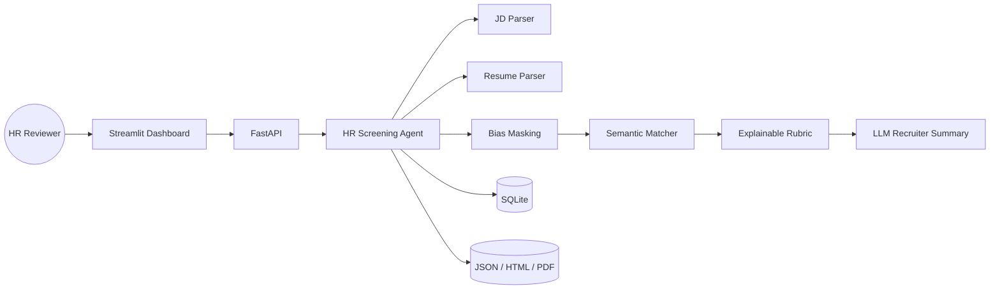
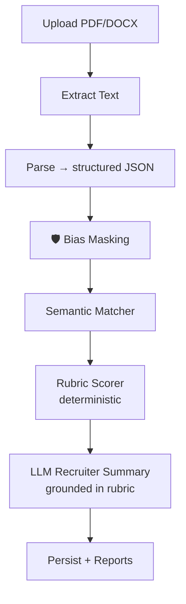

# 🧭 AI-Powered HR Candidate Screening & Ranking Agent

> **A production-grade AI system that helps HR teams parse, score and rank candidates against a job description — explainably, transparently, and with bias mitigation built in.**

[](https://python.org)
[](https://fastapi.tiangolo.com/)
[](https://streamlit.io)
[](#license)
[](https://platform.openai.com/)

---

## 1 · Project Overview

Modern recruiting teams receive **hundreds to thousands** of resumes per role.
Manual screening is slow, inconsistent, and prone to unconscious bias.

**AI HR Agent** is a full-stack platform that automates the front of the recruiting funnel:

- **Parses** Job Descriptions and PDF / DOCX resumes into structured JSON.
- **Masks** bias-prone signals (name, gender, age, address, photo) **before** the AI ever sees them.
- **Scores** candidates against an **explainable 5-dimension rubric** with deterministic weighting.
- **Generates** a recruiter-friendly summary, a confidence score and a recommendation.
- **Lets HR override** any decision — with full audit trail.
- **Exports** every evaluation as **JSON, HTML and PDF**.

The goal is not just to "rank candidates" — it is to give HR a **decision-support tool they can actually trust**, with the math visible at every step.

---

## 2 · Business Problem

| Pain point | Impact | What this project does |
|---|---|---|
| Recruiters spend ~23 hrs per hire on screening alone (SHRM) | Slow time-to-hire | Cuts initial screen to ~5 seconds per resume |
| Keyword-matching ATS misses semantically similar skills (`Postgres` ↔ `PostgreSQL`) | Strong candidates rejected | Embedding-based semantic match |
| Bias from names / photos / addresses leaks into LLM scoring | Legal + ethical risk | PII masked **before** any LLM call |
| Black-box AI scoring | HR can't justify decisions | Every number is traceable to a concrete signal |
| No human override path | AI replaces HR (bad) instead of augmenting them | Built-in HITL with full audit trail |

---

## 3 · Features

### 🤖 Core
- ✅ **JD Parser** (regex + GPT-4o-mini structured extraction)
- ✅ **Resume Parser** for PDF, DOCX, TXT
- ✅ **Semantic Matching Engine** — `sentence-transformers/all-MiniLM-L6-v2` + cosine similarity
- ✅ **Explainable 5-dimension Rubric** — Skills 30%, Experience 25%, Education 15%, Projects 20%, Communication 10%
- ✅ **Recruiter Summary** — concise, evidence-based, identity-blind
- ✅ **Confidence Score** — measures signal strength independent of total
- ✅ **Recommendation Bands** — Strong Hire / Shortlist / Consider / Reject

### 🛡 Differentiators
- ✅ **Bias Mitigation Layer** masking name, gender, age, address, photo, marital, nationality
- ✅ **Human-in-the-Loop Override** — with reason logging and DB audit trail
- ✅ **Multi-format Reports** — JSON / HTML / PDF (ReportLab — no native deps)
- ✅ **Premium Dashboard** — dark theme, Plotly radar + bar + gauge charts
- ✅ **REST API** — full FastAPI surface, OpenAPI docs at `/docs`
- ✅ **Offline-capable** — works without an OpenAI key (heuristic mode)

### 🚀 Optional / Future
- 🔜 LinkedIn ingestion adapter
- 🔜 ChromaDB / FAISS retrieval for candidate-pool search
- 🔜 RAG-powered recruiter chatbot
- 🔜 Multi-agent debate for borderline candidates

---

## 4 · Architecture

> Full diagrams live in [`architecture/architecture.md`](architecture/architecture.md). Highlights:

### System



### Per-resume pipeline



### Module map

```
ai-hr-agent/
├── app.py                 ← single launcher (Streamlit / API / demo)
├── agent.py               ← orchestration façade
├── config.py              ← env-driven settings
│
├── parser/                ← JD + Resume parsers (regex + LLM)
├── utils/                 ← embeddings, cleaner, bias_masking, llm_client
├── scoring/               ← matcher, rubric, explainability
├── reports/               ← JSON / HTML / PDF generation + Jinja template
├── database/              ← SQLite layer
├── api/                   ← FastAPI service
├── frontend/              ← Streamlit dashboard + Plotly + dark theme
│
├── data/                  ← sample JD + sample resumes for the `demo` command
├── architecture/          ← Mermaid diagrams
└── requirements.txt
```

---

## 5 · Tech Stack

| Layer | Tool | Reason |
|---|---|---|
| Frontend | **Streamlit** + custom CSS + **Plotly** | Premium dashboard with no JS build step |
| Backend | **FastAPI** + Uvicorn | Auto-OpenAPI, async, typed |
| LLM | **OpenAI GPT-4o-mini** | Cost-efficient structured extraction + summaries |
| Embeddings | **`sentence-transformers/all-MiniLM-L6-v2`** | Strong + small, runs on CPU |
| Resume parsing | **pdfplumber**, **python-docx** | Robust, no native deps |
| Reports | **Jinja2** + **ReportLab** | HTML + PDF without WeasyPrint |
| Database | **SQLite** | Zero-config; easy upgrade path to Postgres |
| Optional | **ChromaDB**, **FAISS** | For candidate-pool similarity search |

---

## 6 · Explainable AI

The rubric is **fully deterministic**. The LLM is *never* used to compute the score — it is only used to:

1. **Extract structure** from JDs / resumes (validated against a strict JSON schema), and
2. **Write the recruiter summary** *grounded in* the already-computed rubric (the prompt forbids inventing skills).

This means every digit in every report is traceable:

```
total = Σ ( dimension.score / 10 ) · dimension.weight
```

For example:

```json
{
  "skills_match": {
    "score": 8.0,
    "weight": 30,
    "weighted": 24.0,
    "reason": "5/6 required skills matched, 2 preferred bonus.",
    "matched":  ["Python", "FastAPI", "PostgreSQL", "Docker", "AWS"],
    "missing":  ["Kubernetes"]
  }
}
```

A reviewer can see *why* a candidate scored 24 / 30 on Skills — and override it if they disagree.

---

## 7 · Bias Mitigation

Personal-identity signals are masked **before** any text reaches the LLM.

| Category | Examples masked |
|---|---|
| Name | "John Doe", "Name: John Doe", inline mentions |
| Gender | he / she / her / Mr. / Mrs. / man / woman / … |
| Age & DOB | "Age: 27", "DOB: 12/06/1996", "27 years old" |
| Address | "Address: …", ZIP / pincode |
| Photo refs | "photograph", "headshot", "profile picture" |
| Marital / Religion / Nationality | structured statements |
| Contact | email + phone |

The masker emits an **audit report** (categories + counts) that the dashboard surfaces under "🛡 Bias masking audit trail" — so HR can verify what was redacted.

```python
report = mask_pii(resume_text, candidate_name="Aisha Rao")
# → MaskingReport(masked_text=..., items_removed={'name_mentions': 3, 'gender_terms': 6, ...})
```

---

## 8 · Semantic Matching

We compute several signals, all in `[0, 1]`:

| Signal | How |
|---|---|
| `jd_similarity` | Cosine sim between JD's "search corpus" and resume's |
| `skills_overlap` | Average best-match cosine sim of required skills against candidate's skills+tools |
| `tools_overlap` | Same, for tools / tech stack |
| `experience_relevance` | Mean cosine sim per role description vs. JD, then tenure-boosted by `min_experience_years` |
| `project_relevance` | Mean cosine sim per project description vs. JD |
| `education_match` | Cosine sim between JD's education list and candidate's degrees |
| `certification_match` | Set-overlap between required certifications and candidate's |

Embedding model: `all-MiniLM-L6-v2` (384-d, ~80 MB, CPU-friendly).
Embeddings are cached by content-hash so repeated JD calls are free.

---

## 9 · Installation

### Prerequisites
- Python **3.10+**
- ~500 MB disk (for the embedding model on first run)

### Setup

```bash
git clone <this-repo>
cd ai-hr-agent

# create env
python -m venv .venv
source .venv/bin/activate    # (Windows: .venv\Scripts\activate)

# install
pip install -r requirements.txt

# copy env template
cp .env.example .env
# edit .env and set OPENAI_API_KEY (optional — system runs without it)
```

> 💡 **No OpenAI key?** No problem — the system falls back to heuristic JD/resume parsing and a template-based recruiter summary. The deterministic scoring rubric works either way.

---

## 10 · Usage

### A · Streamlit dashboard

```bash
streamlit run app.py
```

Open <http://localhost:8501>.
Workflow:

1. Paste / load a JD on the **Upload** page.
2. Drop one or many PDF / DOCX resumes.
3. Click **🚀 Analyse candidates** → animated progress.
4. Review the **Leaderboard**, drill into **Candidate detail**, override scores, and download JSON / HTML / PDF reports.

### B · REST API

```bash
python app.py api
# or:  uvicorn api.main:app --reload --port 8000
```

OpenAPI docs at <http://localhost:8000/docs>.

```bash
# 1. register a JD
curl -X POST http://localhost:8000/jobs \
     -H "Content-Type: application/json" \
     -d '{"text": "We need a Python ML engineer with FastAPI and AWS..."}'
# → {"job_id": 1, "structured": {...}}

# 2. evaluate a resume
curl -X POST http://localhost:8000/jobs/1/evaluate \
     -F "files=@resume.pdf"

# 3. get the leaderboard
curl http://localhost:8000/jobs/1/ranking

# 4. download a PDF report
curl -o report.pdf http://localhost:8000/evaluations/1/report.pdf

# 5. HR override
curl -X POST http://localhost:8000/evaluations/1/override \
     -H "Content-Type: application/json" \
     -d '{"new_score": 78, "new_recommendation": "Shortlist", "reason": "Promoted based on portfolio quality"}'
```

### C · CLI demo on bundled samples

```bash
python app.py demo
```

Prints a leaderboard for the bundled JD + 4 sample resumes — useful for smoke-testing without uploading anything.

---

## 11 · Sample Output

```
✔ Registered job #1 — AI/ML Engineer (Backend-Focused)
  • Aisha Rao                  87.3/100  (Strong Hire, conf 89%)
  • Marcus Chen                72.4/100  (Shortlist  , conf 78%)
  • Priya Iyer                 68.1/100  (Shortlist  , conf 71%)
  • Derek Olsen                36.5/100  (Reject     , conf 44%)

Leaderboard:
  #1  Aisha Rao                 87.3  Strong Hire
  #2  Marcus Chen               72.4  Shortlist
  #3  Priya Iyer                68.1  Shortlist
  #4  Derek Olsen               36.5  Reject
```

A full evaluation JSON looks like:

```json
{
  "candidate":  { "name": "Aisha Rao", "experience_years": 3.0, ... },
  "job":        { "title": "AI/ML Engineer (Backend-Focused)", ... },
  "evaluation": {
    "total_score": 87.3,
    "recommendation": "Strong Hire",
    "confidence_score": 89.0,
    "dimensions": {
      "skills_match": { "score": 9.0, "weight": 30, "weighted": 27.0, "reason": "...", "matched": [...], "missing": [...] },
      "experience_relevance":     { "score": 8.6, "weight": 25, "weighted": 21.5, ... },
      "education_certifications": { "score": 9.0, "weight": 15, "weighted": 13.5, ... },
      "projects_portfolio":       { "score": 8.4, "weight": 20, "weighted": 16.8, ... },
      "communication_quality":    { "score": 8.5, "weight": 10, "weighted": 8.5,  ... }
    },
    "strengths": ["Skills Match (9.0/10)", "Education & Certifications (9.0/10)"],
    "gaps":      []
  },
  "recruiter_summary": "Candidate shows strong-hire-level alignment with AI/ML Engineer (...).",
  "bias_masking": { "enabled": true, "summary": "Masked → name_mentions: 3, gender_terms: 4, ..." }
}
```

> Sample reports (JSON / HTML / PDF) are auto-written to `outputs/` on first run.

---

## 12 · Screenshots

> Drop your generated screenshots into `screenshots/` and they will render here.

| | |
|---|---|
|  |  |
|  |  |

---

## 13 · Demo Workflow

1. `streamlit run app.py`
2. Click **Paste sample JD** on the Upload tab
3. Upload the 4 sample resumes from `data/sample_resumes/`
4. Click **🚀 Analyse candidates**
5. Open **Leaderboard** → see ranking + score distribution
6. Open **Candidate detail** → radar + bar + gauge charts, recruiter summary, dimension cards
7. Expand **HR override & downloads** → adjust score, save, then download PDF
8. Open the PDF — it includes the same rubric, narrative, strengths/gaps and a coloured recommendation badge

---

## 14 · Future Improvements

- 🔌 **LinkedIn ingestion** — pull additional context from public profiles
- 📚 **RAG over candidate pool** — let HR ask "who in our pipeline has FAISS + Postgres?"
- 🤝 **Multi-agent debate** — 2 LLM agents argue the borderline candidates and a referee picks
- 📈 **Recruiter analytics** — funnel + diversity metrics over time
- 🌐 **i18n** — multilingual JD + resume support
- 🔐 **SSO + role-based access** — recruiter / hiring-manager / admin

---

## 15 · License

MIT — see [`LICENSE`](LICENSE).

---

### Built by an engineer who cares about ethics in AI hiring.

If this project was useful or you have ideas, open an issue — happy to chat.
