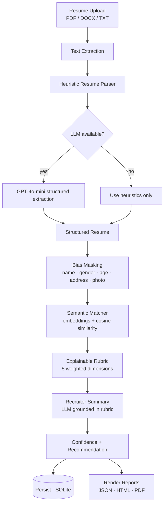
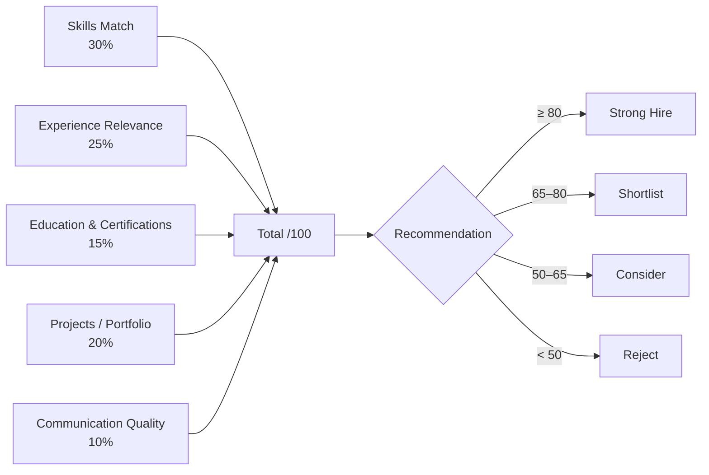
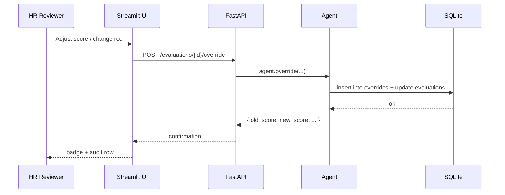

# Architecture

## High-level system

```mermaid
flowchart LR
  subgraph Client
    UI[Streamlit Dashboard]
    HR[HR Reviewer]
  end

  subgraph API[FastAPI Service]
    R1[/POST /jobs/]
    R2[/POST /jobs/:id/evaluate/]
    R3[/GET  /jobs/:id/ranking/]
    R4[/POST /evaluations/:id/override/]
    R5[/GET  /evaluations/:id/report.{pdf,html,json}/]
  end

  subgraph Agent[HR Screening Agent]
    JDP[JD Parser<br/>regex + LLM]
    RP[Resume Parser<br/>pdfplumber / docx / LLM]
    BM[Bias Masking Layer]
    SM[Semantic Matcher<br/>sentence-transformers]
    RB[Explainable Rubric<br/>5 dimensions, deterministic]
    EX[Recruiter Summary<br/>GPT-4o-mini]
  end

  subgraph Storage
    DB[(SQLite<br/>jobs · candidates ·<br/>evaluations · overrides · audit_log)]
    FS[(Reports<br/>JSON / HTML / PDF)]
  end

  HR --> UI
  UI --> API
  API --> Agent
  Agent --> DB
  Agent --> FS
  API --> FS
  RP --> BM --> SM --> RB --> EX
  JDP --> SM
```

## Per-resume processing pipeline



## Scoring rubric



## Human-in-the-loop override flow



## Module map

```
ai-hr-agent/
├── parser/        ← JD + resume parsing (regex + LLM)
├── utils/         ← embeddings · text cleaner · bias masking · LLM client
├── scoring/       ← matcher · rubric · explainability
├── reports/       ← JSON / HTML / PDF renderers
├── database/      ← SQLite layer (jobs, candidates, evaluations, overrides)
├── api/           ← FastAPI surface
├── frontend/      ← Streamlit dashboard + Plotly charts + theme
└── agent.py       ← orchestrator façade
```
